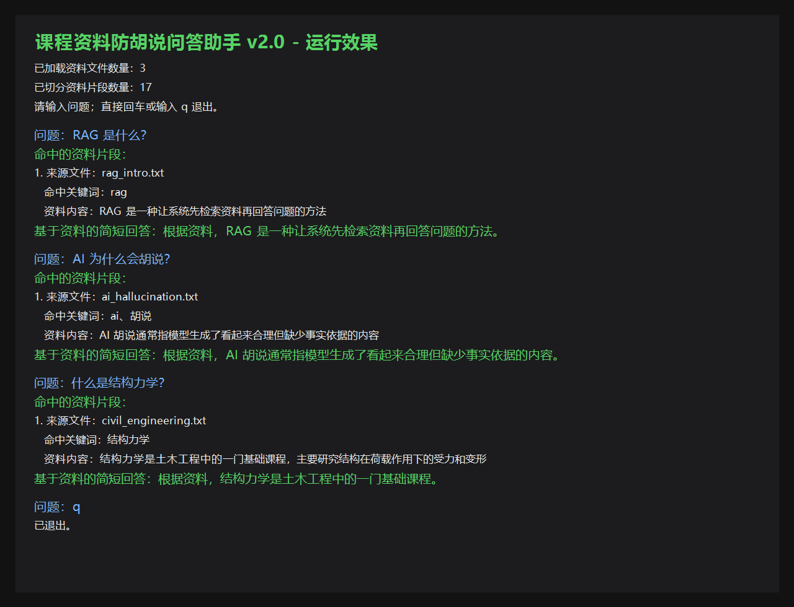

# 课程资料防胡说问答助手

## 项目简介

这是一个基于 RAG 思路的本地课程资料问答助手。它不会直接凭空回答，而是先从本地资料中检索相关片段，再基于命中的资料生成简短回答。如果资料不足，就拒绝回答，避免编造内容。

## 项目背景

本项目来自对一篇关于大模型幻觉、RAG、推理和智能系统的综述论文的学习实践。论文核心观点是：大模型容易生成看似合理但没有依据的内容，因此实际应用中应该尽量让回答基于外部资料、可追溯、可检查。本项目就是这个思想的最小可运行版本。

## 核心功能

- 读取本地资料文件
- 支持 `.txt` 和 `.md` 文件
- 自动切分资料片段
- 根据用户问题进行关键词检索
- 展示命中的资料片段和来源文件
- 根据资料生成简短回答
- 资料不足时拒绝回答，避免胡说
- 自动保存问答记录到 `history.txt`

## 项目版本进展

### v1.0 单文件资料问答

- 读取 `course.txt`
- 根据关键词匹配资料片段
- 实现最小版“有依据回答 / 无依据拒答”

### v2.0 多资料文件问答

- 支持读取 `data` 文件夹下多个 `.txt` 文件
- 每个命中片段显示来源文件
- 增加 RAG、AI 幻觉、结构力学等示例资料

### v3.0 Markdown 支持与问答记录

- 支持读取 `.md` 文件
- 新增 `study_notes.md` 学习笔记
- 自动生成 `history.txt`，保存用户问题、命中来源和回答结果

### v4.0 检索质量优化

- 增加停用词过滤，减少无意义词干扰
- 增加匹配分数，让命中结果更可解释
- 展示命中关键词、来源文件和资料片段
- 资料不足时给出改问建议
- 问答记录中保存匹配信息，方便复盘

## 文件结构

```text
course-rag-qa/
├── data/
│   ├── rag_intro.txt
│   ├── ai_hallucination.txt
│   ├── civil_engineering.txt
│   └── study_notes.md
├── images/
│   └── demo.png
├── course.txt
├── history.txt
├── main.py
└── README.md
```

## 环境要求

- Python 3.x
- 不需要安装第三方库
- 不需要联网
- 不需要配置 API Key

## 运行方法

1. 进入项目目录并运行程序：

```powershell
cd "C:\Users\贾鸿宇\Desktop\course_rag_qa"
python main.py
```

2. 按提示输入问题。

3. 输入 `q` 退出。

## 示例问题

- RAG 是什么？
- AI 为什么会胡说？
- 什么是结构力学？
- RAG 的核心是什么？
- 防止 AI 胡说的关键是什么？
- AI 为什么会产生幻觉？
- 结构力学研究什么？
- 如何避免 AI 胡说？
- Python 能不能读取 PDF？

## 测试说明

可以依次输入以下问题进行测试：

- RAG 的核心是什么？
- AI 为什么会产生幻觉？
- 结构力学研究什么？
- 如何避免 AI 胡说？
- Python 能不能读取 PDF？

预期效果：

- 前四个问题应该能从现有资料中找到相关内容。
- 最后一个问题如果资料不足，可以触发拒答或低匹配提示。

也可以继续测试这些旧版问题：

- RAG 是什么？
- AI 为什么会胡说？
- 什么是结构力学？
- 防止 AI 胡说的关键是什么？

预期效果：

- 如果资料中存在相关内容，程序会输出命中的资料片段、来源文件和简短回答。
- 如果资料中没有相关内容，程序会拒绝回答，避免编造内容。
- 每次问答会自动记录到 `history.txt`。

## 运行效果



## 项目和 RAG 的关系

RAG 的核心是“先查资料，再回答”。本项目没有使用复杂模型和向量数据库，而是用关键词检索做了一个简化版 RAG 流程，帮助理解 RAG 的基本思想。

## 当前版本限制

- 目前使用关键词匹配，不是真正的语义检索
- 没有接入大模型 API
- 不能读取 PDF
- 回答仍然比较模板化
- 适合作为 RAG 入门 Demo，不适合作为生产系统

## 后续升级方向

以下内容是后续计划，当前版本还没有实现：

- 支持读取 PDF
- 加入更好的中文分词
- 加入向量检索
- 接入大模型 API，让回答更自然
- 做一个简单网页界面

## 学习收获

- 理解了 RAG 的基本流程：先检索资料，再基于资料回答
- 理解了大模型幻觉问题，以及为什么需要让回答有依据
- 使用 Python 实现了本地资料读取、资料切分、关键词检索和来源展示
- 学会了用 GitHub 组织和展示一个可运行的 AI 入门项目
- 完成了从论文思想到可运行 Demo 的一次实践

## 项目定位

这是我的第一个 AI 应用入门项目，重点不是复杂算法，而是把论文中的 RAG 思想转化成一个能运行、能展示、能继续升级的 Python Demo。
